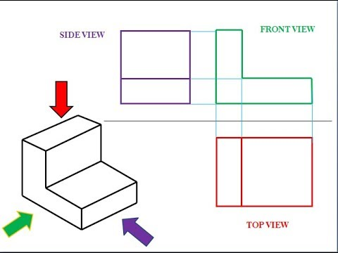
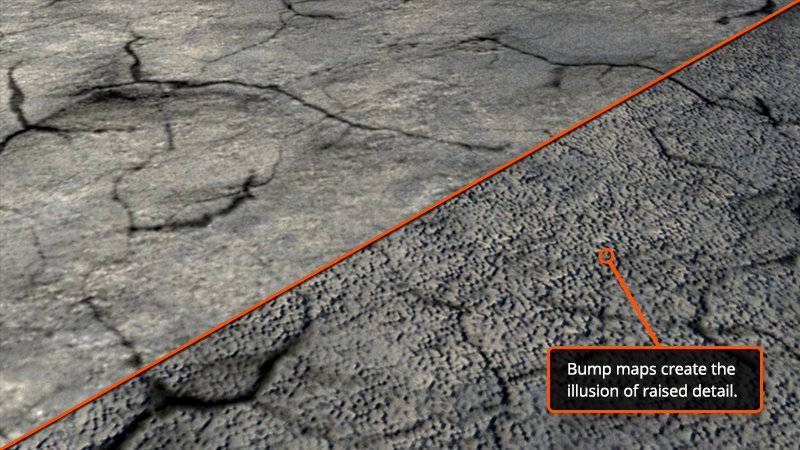
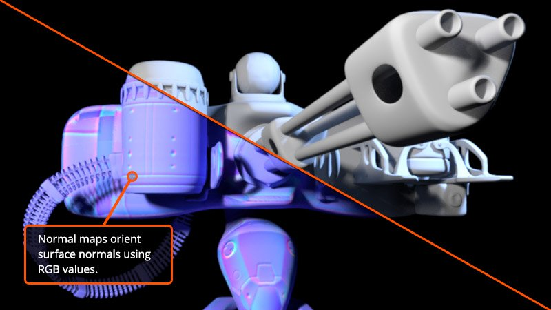
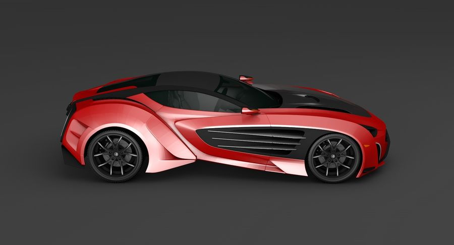

<!-- $theme: default -->

<!-- page_number: true -->

Introduction to 3D
===

##### Supinfo

###### Created by Dimitri Karol ( [@DimitriKar](https://github.com/DimitriKar) )

---

Common 3D Shapes :
===

 ## Primitives (basics) 3D objects
* Sphere
* Torus
* Cylinder
* Cone
* Cube
* Tube

---

## Properties of 3D shapes

3D shapes have faces (sides), edges and vertices (corners)

* **Faces**
    * A ``face`` is a ``flat`` or ``curved surface`` on a 3D shape. 
* **Edges**
    * An ``edge`` is where two faces meet
* **Vertices**
    * A ``vertex`` is a **``corner``** where edges meet.

---

---

3D Surfaces :
===

### **Important aspects**

* The ``triangle`` is a fundamental unit of a surface in 3D.
* ``Specularity`` is the visual appearance of reflections
    * Specularity is this bright highlight on the object, and it gives the impression that the object is shiny

---

##### 

---

### **Create surfaces in 3D**

* With curves and surfaces => ***two main*** technologies
    * ``NURBS`` modeling
    * ``Bezier`` patch modeling
  
---

Some interesting aspects from videos :
===

* Most 3D software has origin coordinates, x y z ``0.0.0`` but the origin is really just an arbitrary point in space that was defined by the software.
* Rendering is the virtual equivalent of photography
* ``Orthographic projection`` is a means of representing three-dimensional objects (3D) in two dimensions (2D).
---
## Orthographic projection
##### 

---

Bump Map
===
> Bump maps create the illusion of depth and texture on the surface of a 3D model using computer graphics. Textures are artificially created on the surface of objects using grayscale and simple lighting tricks, rather than having to manually create individual bumps and cracks.

---
# 
---

Normal Map
===

> Normal maps can be referred to as a newer, better type of bump map. As with bump maps, the first thing you need to understand about normal maps is that the detail they create is also fake. There's no additional resolution added to the geometry in your scene.

---

# 

---

What is a **Material** ?
===

> A 3D model is simply a definition of an object's shape. If we want to make that surface look real, we need to add qualities such as color, texture, reflectivity, and transparency. These qualities are defined by a material. The material tells the renderer how the surface interacts with light. 

---
# Without material
# 

---
# With material
# 

---

Finita la comedia
===

# 
