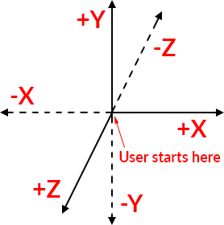
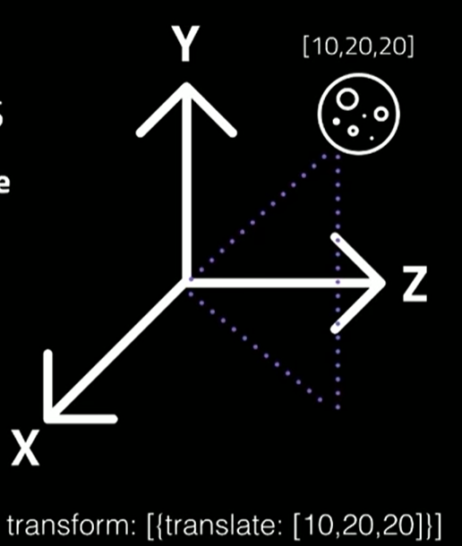

React VR (RIP 2017) => React 360
===

# 

##### Supinfo

###### Created by Dimitri Karol ( [@DimitriKar](https://github.com/DimitriKar) )

---

What is React 360 ???
===


---

> React 360 is a framework for the creation of interactive 360 experiences that run in your web browser. It pairs modern APIs like WebGL and WebVR with the declarative power of React, producing applications that can be consumed through a variety of devices. Leveraging web technologies and the existing React ecosystem, React 360 aims to simplify the construction of cross-platform 360 experiences.

React 360 works with :
- Web browsers
- Gear VT headset

---

Start with React 360
===

```
yarn global add react-360-cli || npm install -g react-360-cli
react-360 init project-name
cd project-name
yarn start || npm start
```
Open browser at http://localhost:8081/index.html

---

Project Structure
===

## **index.js**
>This is the main code of your application, it is where all of your React code lives. This is the code that makes your application unique, and determines how it looks. Any code imported by index.js will also become a part of your app, allowing you to organize your app into many different files.

---

## client.js
> This is the code that connects your browser to your React application – the Runtime. This file does three things. First, it creates a new instance of React 360, loading your React code and attaching it to a specific place in the DOM. This is also where your application can pass a variety of initialization options, which will be discussed later.

> Next, the file actually places your React code into the scene. The mount point declared in index.js is attached to the Default Surface of your app – a cylindrical layer on which a 2D UI can be placed.

> Finally, the starter project immediately adds a 360 background photo. This part is optional, but allows the photo to show while your React code is still loading, letting the user see something as soon as possible.

---

## index.html
> This is the web page you load when viewing your application. All it does is provide a point to mount your JavaScript code. This is intentional. Most functionality is left out of HTML, so that you can easily integrate your React 360 application into server-render pages or existing web apps.

---

3D Axis
===

React 360 use 3 axis :
- x
- y
- z

Base coordinates : 0 0 0

> Y : Move **Up Down**
> Z : Move **Forward Back**
> X : Move **Right Left**

---

# 

---

React 360 Components :
===

* [View](https://facebook.github.io/react-360/docs/view.html)
* [Image](https://facebook.github.io/react-360/docs/image.html)
* [Entity](https://facebook.github.io/react-360/docs/entity.html)
* [VrButton](https://facebook.github.io/react-360/docs/vr-button.html)

---

Place an Entity :
===

To place your Entity in your 360 environment you must use styles 

```
style={{
    transform: [
        {translate: [4, 0.70, -4]},
        { scale: 0.001 },
        { rotateX: -90 }
    ]
    }} 
```

First parameter will always be **translate**
>  Because if you put translate after, for example, scale or rotate it's not going to apply those translations to the object.

---

# 

---

[Playing Audio](https://facebook.github.io/react-360/docs/audio.html)
===

## Environmental Audio

> Environmental audio is used to create background noise in your application: music, bustling city noises, rushing water, or anything else that sets the mood of your scene.

**AudioModule** exposes a **playEnvironmental()** method to trigger environmental audio

---

### It takes some props : 
- source - the path to the audio resource
- volume - the volume at which to play the audio, from 0 to 1
- loop - whether to loop the playback of the audio
- muted - whether the audio should be muted. When audio is unmuted, it returns to the same volume -  - level it was at before it was muted.
- volume - a new volume at which to play the audio, from 0 to 1
- fadeTime - an optional length of time (in milliseconds) over which the volume should change. This - is used for smooth transitions in audio volume.

---

## Sound Effects

```
import {asset, NativeModules, VrButton} from 'react-360';
const {AudioModule} = NativeModules;

// Play a sound when the button is clicked
<VrButton
  onClick={() => {
    AudioModule.playOneShot({
      source: asset('click.wav'),
    });
  }}>
  { /* ... */ }
</VrButton>
```

---

FINISH
===

